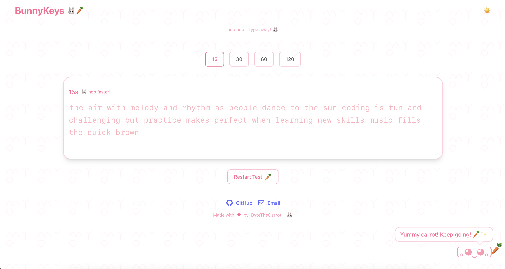

# 🥕 BunnyKeys

A delightful typing speed test application with a bunny theme! Practice your typing skills while being cheered on by an adorable bunny companion who loves carrots.



## ✨ Features

- 🎯 Real-time WPM (Words Per Minute) tracking
- 🐰 Adorable bunny mascot with dynamic reactions
- 📊 Detailed typing statistics and performance graphs
- ⏱️ Flexible time duration options (30s, 60s, 120s)
- 🌙 Dark mode support
- 🎵 Cute bunny sound effects
- 📱 Fully responsive design

## 🚀 Quick Start

### Prerequisites

- Node.js (v14 or higher)
- npm or yarn

### Installation

1. Clone the repository
```bash
git clone https://github.com/ByteTheCarrot/carrot-type.git
```

2. Install dependencies
```bash
npm install

# or

yarn install
```

3. Start the development server
```bash
npm run dev

# or

yarn dev
```

4. Open http://localhost:5173 in your browser

## 🛠️ Tech Stack
- React 18
- TypeScript
- Tailwind CSS
- Vite

## 🤝 Contributing
Contributions are what make the open source community such an amazing place to learn, inspire, and create. Any contributions you make are greatly appreciated .

1. Fork the project
2. Create your feature branch ( git checkout -b feature/AmazingFeature )
3. Commit your changes ( git commit -m 'Add some AmazingFeature' )
4. Push to the branch ( git push origin feature/AmazingFeature )
5. Open a Pull Request

## 📝 License
Distributed under the MIT License. See LICENSE for more information.

## 🌟 Acknowledgments
- Bunny illustrations taken from Google  credit goes to the respective owners
Made with 🥕 by ByteTheCarrot
 ```
